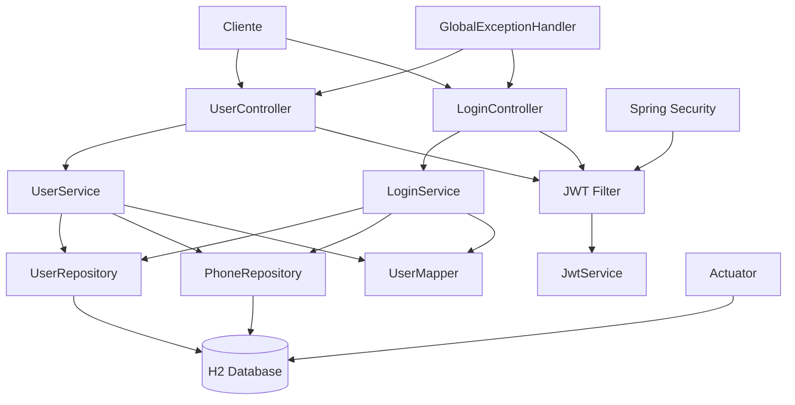

# 🚀 BCI Challenge - User Management Microservice

Este microservicio proporciona endpoints para la gestión de usuarios con autenticación JWT, construido con WebFlux y base de datos reactiva.

## 👤 Desarrollador
**Junior Pedro Pecho Mendoza**  
**Software Engineer**

## 🛠️ Tecnologías

- **Java 17** (Amazon Corretto)
- **Spring Boot 3.5.4**
- **Spring WebFlux** (Programación reactiva)
- **Spring Data R2DBC** (Base de datos reactiva)
- **Spring Security** (Autenticación y autorización)
- **Maven 3.8+** (Gestión de dependencias)
- **H2 Database** (Base de datos en memoria)
- **JWT (JSON Web Tokens)** (Autenticación)
- **Jakarta EE** (Validaciones)
- **Spock Framework** (Testing con Groovy)
- **OpenAPI 3 + Swagger UI** (Documentación de API)
- **Docker** (Containerización)

## ✨ Características

- ✅ **Registro de usuarios** con validación robusta de email y contraseña
- ✅ **Autenticación JWT** con tokens seguros (validación y generación)
- ✅ **Arquitectura de microservicios** con controladores separados
- ✅ **Programación reactiva** con WebFlux y R2DBC
- ✅ **Validaciones personalizadas** (contraseña con criterios específicos)
- ✅ **Base de datos H2** en memoria para desarrollo
- ✅ **Manejo global de excepciones** con respuestas estructuradas
- ✅ **Documentación OpenAPI/Swagger** interactiva
- ✅ **Health checks** con Spring Actuator
- ✅ **Tests unitarios** con Spock Framework (cobertura >80%)
- ✅ **Containerización** con Docker
- ✅ **Seguridad** con Spring Security y encriptación BCrypt

## 🚀 Construcción y Ejecución

### Prerrequisitos
- Java 17 o superior
- Maven 3.8+ o usar el wrapper incluido
- Docker (opcional)

### 🔨 Opción 1: Ejecución local

1. **Clonar el repositorio:**
```bash
git clone <repository-url>
cd challenge-bci
```

2. **Construir el proyecto:**
```bash
./mvnw clean compile
```

3. **Ejecutar tests:**
```bash
./mvnw test
```

4. **Generar JAR:**
```bash
./mvnw clean package
```

5. **Ejecutar la aplicación:**
```bash
./mvnw spring-boot:run
```

O ejecutar el JAR generado:
```bash
java -jar target/challenge-bci-0.0.1-SNAPSHOT.jar
```

### 🐳 Opción 2: Docker

1. **Construir y ejecutar con Docker Compose:**
```bash
docker-compose up --build
```

2. **Solo construir la imagen:**
```bash
docker build -t bci-challenge .
```

3. **Ejecutar el contenedor:**
```bash
docker run -p 8080:8080 bci-challenge
```

## 🌐 Endpoints

La aplicación estará disponible en `http://localhost:8080`

### 👤 Gestión de Usuarios

#### 🔐 Registro de Usuario
**POST** `/api/user/sign-up`

```json
{
  "name": "Juan Rodriguez",
  "email": "juan@rodriguez.org",
  "password": "Password1a2",
  "phones": [
    {
      "number": "123456789",
      "citycode": 1,
      "countrycode": "57"
    }
  ]
}
```

**Respuesta exitosa (201):**
```json
{
  "id": "550e8400-e29b-41d4-a716-446655440000",
  "name": "Juan Rodriguez",
  "email": "juan@rodriguez.org",
  "phones": [
    {
      "number": "123456789",
      "citycode": 1,
      "countrycode": "57"
    }
  ],
  "created": "2025-08-08T10:30:00",
  "lastLogin": null,
  "token": "eyJhbGciOiJIUzI1NiIsInR5cCI6IkpXVCJ9...",
  "isActive": true
}
```

### 🔑 Autenticación

#### ✅ Validar Token JWT Existente
**GET** `/api/login/validate`

**Header requerido:**
```
Authorization: Bearer <token-jwt>
```

**Respuesta exitosa (200):**
```json
{
  "id": "550e8400-e29b-41d4-a716-446655440000",
  "name": "Juan Rodriguez",
  "email": "juan@rodriguez.org",
  "phones": [...],
  "created": "2025-08-08T10:30:00",
  "lastLogin": "2025-08-08T11:00:00",
  "token": "eyJhbGciOiJIUzI1NiIsInR5cCI6IkpXVCJ9...",
  "isActive": true
}
```

#### 🔓 Autenticar con Credenciales
**POST** `/api/login/authenticate`

```json
{
  "email": "juan@rodriguez.org",
  "password": "Password1a2"
}
```

**Respuesta exitosa (200):**
```json
{
  "id": "550e8400-e29b-41d4-a716-446655440000",
  "name": "Juan Rodriguez",
  "email": "juan@rodriguez.org",
  "phones": [...],
  "created": "2025-08-08T10:30:00",
  "lastLogin": "2025-08-08T11:15:00",
  "token": "eyJhbGciOiJIUzI1NiIsInR5cCI6IkpXVCJ9...",
  "isActive": true
}
```

### 📊 Monitoreo
- **Health Check:** `GET /actuator/health`

### 📚 Documentación
- **OpenAPI JSON:** `http://localhost:8080/v3/api-docs`
- **Swagger UI:** `http://localhost:8080/swagger-ui.html`

## 🏗️ Estructura del Proyecto

```
src/main/java/com/bci/
├── config/                 # Configuraciones
│   ├── DatabaseConfig.java
│   ├── SecurityConfig.java
│   ├── SwaggerConfiguration.java
│   └── JwtAuthenticationWebFilter.java
├── controller/             # Controladores REST
│   ├── UserController.java      # Gestión de usuarios
│   └── LoginController.java     # Autenticación
├── entity/                 # Entidades JPA
│   ├── User.java
│   └── Phone.java
├── exception/              # Manejo de excepciones
│   ├── GlobalExceptionHandler.java
│   ├── UserExistsException.java
│   ├── UserNotFoundException.java
│   ├── ValidationException.java
│   ├── InvalidTokenException.java
│   └── UserError.java
├── mapper/                 # Mappers DTO ↔ Entity
│   └── UserMapper.java
├── model/                  # DTOs
│   ├── UserSignUpRequestDTO.java
│   ├── UserResponseDTO.java
│   ├── LoginRequestDTO.java
│   ├── PhoneRequestDTO.java
│   ├── PhoneResponseDTO.java
│   └── ErrorResponseDTO.java
├── repository/             # Repositories R2DBC
│   ├── UserRepository.java
│   └── PhoneRepository.java
├── service/                # Lógica de negocio
│   ├── UserService.java         # Gestión de usuarios
│   ├── LoginService.java        # Autenticación
│   ├── JwtService.java          # Manejo de JWT
│   └── impl/
│       ├── UserServiceImpl.java
│       ├── LoginServiceImpl.java
│       └── JwtServiceImpl.java
└── ChallengeBciApplication.java

src/test/groovy/com/bci/reto/
├── service/                # Tests de servicios
│   ├── UserServiceSpec.groovy
│   ├── LoginServiceSpec.groovy
│   └── JwtServiceSpec.groovy
└── controller/             # Tests de controladores
    ├── UserControllerSpec.groovy
    └── LoginControllerSpec.groovy

src/main/resources/
├── application.yml         # Configuración
└── schema.sql             # Script de BD
```

## 🧪 Testing

El proyecto incluye tests unitarios con **Spock Framework**:

```bash
# Ejecutar todos los tests
./mvnw test

# Ejecutar tests específicos
./mvnw test -Dtest=UserServiceSpec
./mvnw test -Dtest=LoginServiceSpec

# Tests de controladores
./mvnw test -Dtest=*ControllerSpec

# Reporte de cobertura
./mvnw jacoco:report
```

### Cobertura de Tests
- ✅ **UserService** - Registro de usuarios, validaciones
- ✅ **LoginService** - Autenticación JWT y credenciales
- ✅ **JwtService** - Generación y validación de tokens
- ✅ **UserController** - Endpoints de gestión de usuarios
- ✅ **LoginController** - Endpoints de autenticación

## 🔒 Validaciones de Contraseña

La contraseña debe cumplir los siguientes criterios:
- ✅ Al menos una letra mayúscula
- ✅ Al menos una letra minúscula
- ✅ Exactamente dos números no consecutivos
- ✅ Entre 8 y 12 caracteres de longitud
- ✅ Solo letras y números

**Ejemplos válidos:** `Password1a2`, `Secure9b8`, `Test1c3def`

## 📊 Respuestas de Error

### Códigos HTTP Utilizados
- **200** - OK (autenticación exitosa)
- **201** - Created (usuario registrado)
- **400** - Bad Request (datos inválidos, contraseña incorrecta)
- **401** - Unauthorized (token inválido, credenciales incorrectas)
- **404** - Not Found (usuario no encontrado)
- **409** - Conflict (email ya registrado)

### Estructura de Error
```json
{
  "mensaje": "La contraseña debe tener una letra mayúscula, una minúscula, exactamente dos números no consecutivos y tener entre 8 y 12 caracteres"
}
```

## 🔧 Configuración

### Variables de Entorno

```bash
# JWT Configuration
JWT_SECRET=4qhq8LrEBfYcaRHxhdb9zURb2rf8e7Ud8GLO9L6brain2rvUKu7C
JWT_EXPIRATION=86400000  # 24 horas

# Database
SPRING_R2DBC_URL=r2dbc:h2:mem:///userdb;DB_CLOSE_DELAY=-1
SPRING_R2DBC_USERNAME=sa
SPRING_R2DBC_PASSWORD=

# Logging
LOGGING_LEVEL_COM_BCI=DEBUG
SPRING_PROFILES_ACTIVE=dev
```

### Rutas de Seguridad

#### 🔓 Rutas Públicas (no requieren autenticación)
- `/api/user/sign-up` - Registro de usuarios
- `/api/login/validate` - Validación de token
- `/api/login/authenticate` - Autenticación con credenciales
- `/actuator/**` - Endpoints de monitoreo
- `/v3/api-docs/**` - Documentación OpenAPI
- `/swagger-ui/**` - Interfaz Swagger

#### 🔒 Rutas Protegidas
- Cualquier otra ruta bajo `/api/**` requiere token JWT válido

## 📊 Diagramas

### 🔄 Diagrama de Secuencia - Registro de Usuario

```mermaid
sequenceDiagram
    participant C as Cliente
    participant UC as UserController
    participant US as UserService
    participant UR as UserRepository
    participant PR as PhoneRepository
    participant JWT as JwtService
    participant DB as H2 Database

    Note over C,DB: Registro de Usuario
    C->>+UC: POST /api/user/sign-up
    UC->>+US: signUp(request)
    US->>+UR: findByEmail(email)
    UR->>+DB: SELECT user WHERE email=?
    DB-->>-UR: Mono.empty()
    UR-->>-US: Usuario no existe
    US->>+UR: save(user)
    UR->>+DB: INSERT INTO users
    DB-->>-UR: Usuario guardado
    UR-->>-US: Usuario con ID
    US->>+JWT: generateToken(user)
    JWT-->>-US: JWT Token
    US->>+UR: save(userWithToken)
    UR->>+DB: UPDATE user SET token=?
    DB-->>-UR: Usuario actualizado
    UR-->>-US: Usuario final
    alt Con teléfonos
        US->>+PR: saveAll(phones)
        PR->>+DB: INSERT INTO phones
        DB-->>-PR: Teléfonos guardados
        PR-->>-US: Lista de teléfonos
    end
    US-->>-UC: UserResponseDTO
    UC-->>-C: 201 Created + UserResponseDTO
```



### 🔄 Diagrama de Secuencia - Autenticación

```mermaid
sequenceDiagram
    participant C as Cliente
    participant LC as LoginController
    participant LS as LoginService
    participant JWT as JwtService
    participant UR as UserRepository
    participant PR as PhoneRepository
    participant DB as H2 Database

    Note over C,DB: Autenticación con Credenciales
    C->>+LC: POST /api/login/authenticate
    LC->>+LS: loginWithCredentials(request)
    LS->>+UR: findByEmail(email)
    UR->>+DB: SELECT user WHERE email=?
    DB-->>-UR: Usuario encontrado
    UR-->>-LS: Usuario existente
    LS->>LS: validatePassword(password)
    alt Contraseña válida
        LS->>+JWT: generateToken(user)
        JWT-->>-LS: Nuevo JWT Token
        LS->>+UR: save(updatedUser)
        UR->>+DB: UPDATE last_login, token
        DB-->>-UR: Usuario actualizado
        UR-->>-LS: Usuario guardado
        LS->>+PR: findByUserId(userId)
        PR->>+DB: SELECT phones WHERE user_id=?
        DB-->>-PR: Lista de teléfonos
        PR-->>-LS: Teléfonos del usuario
        LS-->>-LC: UserResponseDTO
        LC-->>-C: 200 OK + UserResponseDTO
    else Contraseña inválida
        LS-->>LC: ValidationException
        LC-->>C: 400 Bad Request
    end

    Note over C,DB: Validación de Token
    C->>+LC: GET /api/login/validate + Bearer Token
    LC->>+LS: login(authHeader)
    LS->>+JWT: validateTokenAndGetEmail(token)
    JWT-->>-LS: Email del usuario
    LS->>+UR: findByEmail(email)
    UR->>+DB: SELECT user WHERE email=?
    DB-->>-UR: Usuario encontrado
    UR-->>-LS: Usuario existente
    LS->>+JWT: generateToken(user)
    JWT-->>-LS: Nuevo JWT Token
    LS->>+UR: save(updatedUser)
    UR->>+DB: UPDATE last_login, token
    DB-->>-UR: Usuario actualizado
    UR-->>-LS: Usuario guardado
    LS->>+PR: findByUserId(userId)
    PR->>+DB: SELECT phones WHERE user_id=?
    DB-->>-PR: Lista de teléfonos
    PR-->>-LS: Teléfonos del usuario
    LS-->>-LC: UserResponseDTO
    LC-->>-C: 200 OK + UserResponseDTO
```



### 🏗️ Diagrama de Arquitectura



## 📈 Métricas 

### Endpoints de Monitoreo
```bash
# Estado general
curl http://localhost:8080/actuator/health

```

## 🎯 Casos de Uso

### Flujo Típico de Usuario
1. **Registro:** `POST /api/user/sign-up` - El usuario se registra y recibe un token
2. **Autenticación:** `POST /api/login/authenticate` - Login con email/password
3. **Validación:** `GET /api/login/validate` - Validar token existente para sesiones activas

### Casos de Error Comunes
- **Email duplicado:** 409 Conflict
- **Contraseña inválida:** 400 Bad Request
- **Usuario no encontrado:** 404 Not Found
- **Token expirado:** 401 Unauthorized
- **Credenciales incorrectas:** 401 Unauthorized

---

📧 **Contacto:** [jppm1850@gmail.com](mailto:jppm1850@gmail.com)